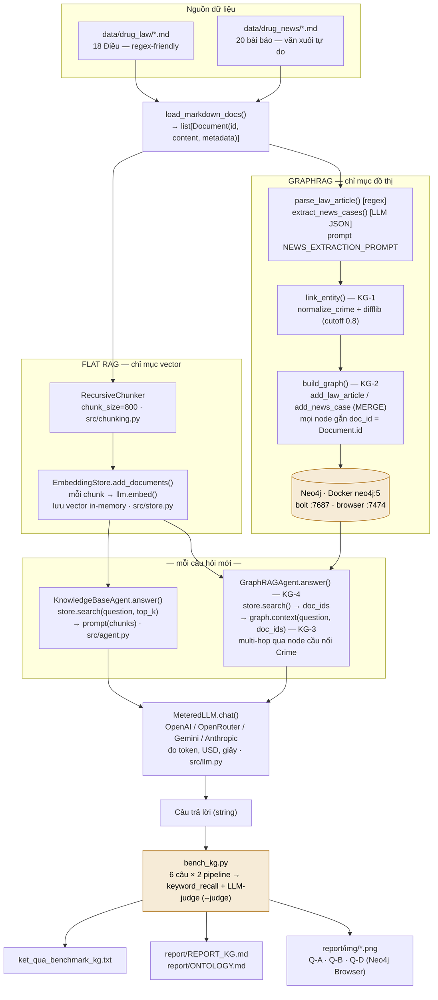
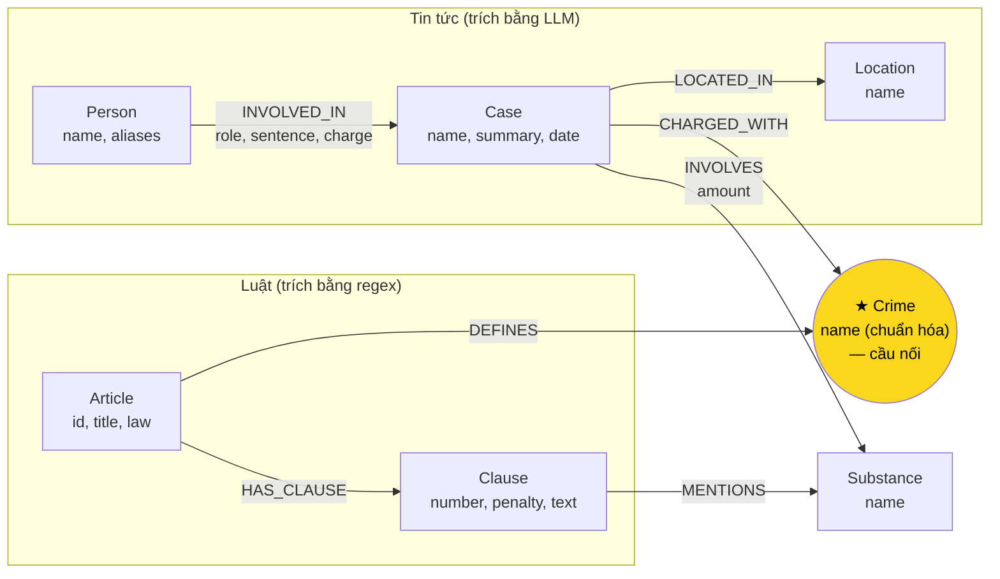

# Kiến trúc & Workflow — Flat RAG vs GraphRAG

> Tài liệu tham khảo nội bộ, tổng hợp từ README.md, LAB_GUIDE.md, SUBMISSION.md, report/ONTOLOGY.md,
> report/REPORT_KG.md và toàn bộ code (`src/`, `bench_kg.py`, `tests/`). Không phải file bắt buộc nộp
> (xem SUBMISSION.md mục 1 cho danh sách nộp) — dùng để tự theo dõi tiến độ khi làm lab.

**Trạng thái hiện tại của repo** (tại thời điểm viết tài liệu này):

| Phần | Trạng thái |
| --- | --- |
| `src/agent.py` (Flat RAG) | Đã xong |
| `tests/test_base.py` | 41 passed |
| `src/graph.py` — KG-1 `link_entity` | ❌ `raise NotImplementedError` |
| `src/graph.py` — KG-2 `build_graph` | ❌ `raise NotImplementedError` |
| `src/graph.py` — KG-3 `Neo4jGraph.context` | ❌ `raise NotImplementedError` |
| `src/graph.py` — KG-4 `GraphRAGAgent.answer` | ❌ `raise NotImplementedError` |
| `report/ONTOLOGY.md` | Template trống |
| `report/REPORT_KG.md` | Template trống |

---

## 1. Tổng quan

Repo build hai pipeline hỏi-đáp trên cùng dữ liệu, cùng LLM, để đo khi nào cần Knowledge Graph và nó tốn
thêm bao nhiêu. Câu hỏi khó nhất yêu cầu nối tên bị cáo (chỉ có trong tin) với khung hình phạt (chỉ có
trong luật) — không đoạn văn nào chứa cả hai.

| Chỉ số | Giá trị |
| --- | --- |
| Điều luật (`data/drug_law/`) | 18 — regex-friendly (Điều → khoản → điểm) |
| Bài báo (`data/drug_news/`) | 20 — văn xuôi tự do |
| Câu hỏi benchmark (`data/benchmark_kg.json`) | 6 |
| Hàm TODO trong `src/graph.py` | 4 (KG-1 .. KG-4) |
| Test mong đợi khi xong | 48 (41 base + 7 graph) |
| Node cầu nối gợi ý | `Crime` |

**Loại câu hỏi trong benchmark:**

| Câu | Loại | Cần dữ liệu từ |
| --- | --- | --- |
| Q1 | single-hop-law | chỉ luật |
| Q2 | single-hop-news | chỉ tin |
| Q3 | cross-kb | luật + tin |
| Q4 | cross-kb | luật + tin |
| Q5 | cross-kb-multi-hop | luật + tin, nhiều bước |
| Q6 | aggregation | nhiều bài tin |

Flat RAG trả lời tốt Q1–Q2 (đáp án nằm gọn 1 đoạn). Q3–Q5 cần xuyên 2 KB qua node cầu nối. Q6 cần gộp
dữ kiện từ nhiều tài liệu — đúng chỗ GraphRAG được kỳ vọng thắng.

---

## 2. Kiến trúc hệ thống

Hai nguồn dữ liệu nạp qua một loader chung, rồi rẽ thành hai chỉ mục song song — vector (Flat RAG) và đồ
thị Neo4j (GraphRAG). Mỗi câu hỏi mới chạy qua cả hai agent, cùng gọi chung một `MeteredLLM` để sinh câu
trả lời cuối, rồi `bench_kg.py` gom điểm và chi phí.

> Vector search luôn chạy trước trong cả hai agent — GraphRAG không bao giờ có ít ngữ cảnh hơn Flat RAG,
> graph chỉ **thêm** dữ kiện chứ không thay thế (LAB_GUIDE Bước 6).

---

## 3. Ontology gợi ý (HINT trong `src/graph.py`)

`Crime` là node cầu nối: luật **định nghĩa** tội qua `DEFINES`, vụ án trong tin **bị truy tố** tội đó qua
`CHARGED_WITH`. Tội danh LLM trích ra được `link_entity` map về đúng tên chuẩn trong luật trước khi ghi
vào graph — nếu bước này sai, cầu nối tách đôi và hai KB không bao giờ gặp nhau.

> Node vàng = cầu nối duy nhất giữa hai KB. Nếu `link_entity` không khớp được tội danh do LLM đặt tên với
> tên chuẩn trong luật, graph sinh ra 2 node `Crime` riêng biệt và mọi câu hỏi cross-kb sẽ gãy (lỗi E1).

### Entity types

| Label | Khóa (`MERGE` theo) | Lấy từ | Trích bằng |
| --- | --- | --- | --- |
| `Article`, `Clause` | `id` ("Điều 251 BLHS", "… khoản 1") | luật | regex — `parse_law_article` |
| `Crime` | `name` (đã chuẩn hóa) | luật (tiêu đề Điều) | regex + `normalize_crime` |
| `Case`, `Person`, `Location` | `name` | tin | LLM — `extract_news_cases` |
| `Substance` | `name` | cả hai | regex (luật) + LLM (tin) |

### Điểm yếu đã biết (hướng cải tiến nếu làm bonus +15)

- `Case`/`Person` khóa theo tên do LLM tự đặt → dễ trùng node cho cùng một người/vụ.
- `Substance` không gộp được tên đồng nghĩa (vd "ma túy đá" vs "Methamphetamine").
- Không mô hình hóa ngưỡng khối lượng trong khoản luật dưới dạng dữ liệu truy vấn được.
- Không phân biệt các giai đoạn tố tụng (bắt, khởi tố, xét xử, phúc thẩm).

---

## 4. Luồng xử lý chi tiết

### 4.1 — Indexing (chạy một lần, trước khi hỏi)

1. **Flat RAG:** `chunk_docs()` cắt mọi `Document` (luật + tin) bằng `RecursiveChunker(chunk_size=800)` →
   `store.add_documents(chunks)` gọi `llm.embed()` cho từng chunk, lưu vector trong `EmbeddingStore`
   (in-memory, dot product).
2. **GraphRAG — luật (regex, rẻ, ổn định):** `parse_law_article(doc)` tách Điều → khoản bằng
   `CLAUSE_START` regex, tìm khung hình phạt (`bị phạt|tù|cảnh cáo…`) và chất ma túy
   (`find_substances`) trong mỗi khoản → `graph.add_law_article(article)` ghi `Article`/`Clause`/`Crime`/
   `Substance` bằng `MERGE`.
3. **GraphRAG — tin (LLM, cần hiểu văn xuôi):** `extract_news_cases(doc, llm_fn, known_crimes)` gọi LLM
   với `NEWS_EXTRACTION_PROMPT` (`json_mode=True`), nhận về `cases[]` gồm người/chất/mức án → mỗi tội
   danh và mỗi tội của từng người chạy qua `link_entity(x, known_crimes)` để khớp về tên chuẩn trong luật
   → `graph.add_news_case(case, doc)` ghi `Case`/`Person`/`Location`/`Substance`, nối `CHARGED_WITH` sang
   đúng node `Crime` đã có từ bước luật.
4. **Hợp đồng bắt buộc:** mọi node sinh từ một tài liệu phải mang `doc_id = Document.id` — đây là thứ
   `agent.answer()` và `bench_kg.py --check` dựa vào để nối chunk vector với node graph, không phụ thuộc
   tên label.

### 4.2 — Query time (mỗi câu hỏi)

| # | Flat RAG (`KnowledgeBaseAgent`) | GraphRAG (`GraphRAGAgent`) |
| --- | --- | --- |
| 1 | `chunks = store.search(question, top_k)` — **giống hệt nhau** ở cả hai agent | |
| 2 | Đánh số chunk `[1] [2] …` vào prompt | Lấy `doc_id` không trùng từ `chunks[i]["metadata"]["doc_id"]` |
| 3 | — | `facts = graph.context(question, doc_ids)`: xem chi tiết bên dưới |
| 4 | Điền prompt cơ bản (ngữ cảnh + câu hỏi) | Điền `GRAPH_PROMPT` với `facts` (mỗi dòng bắt đầu `- `) + `chunks` + `question` |
| 5 | `return self.llm_fn(prompt)` — cùng một `MeteredLLM.chat()` | |

Chi tiết bước 3 (`graph.context`):

- `seed_facts()` — node có `doc_id` khớp hoặc `name`/`aliases` xuất hiện trong câu hỏi, cộng cạnh 1 bước
  quanh đó (đã viết sẵn, không phụ thuộc ontology).
- Từ seed, đi qua `Crime` (cầu nối) sang KB còn lại:
  `(Case)-[:CHARGED_WITH]->(Crime)<-[:DEFINES]-(Article)-[:HAS_CLAUSE]->(Clause)`
- Giữ khoản 1 (khung cơ bản) + khoản `MENTIONS` chất mà vụ `INVOLVES`.
- Câu hỏi nhắc thẳng "Điều N" → lấy khoản 1 + khoản khớp chất trong câu hỏi.

### 4.3 — Benchmark (`bench_kg.py`)

Với mỗi lệnh (`--check` / `--build` / không cờ / `--judge`), graph cũ bị **xóa và dựng lại** từ
`build_graph` của bạn. Chạy đủ `--judge` sẽ:

1. Embed toàn bộ chunk của 2 KB (Flat RAG index).
2. Reset graph, gọi `build_graph` trên toàn bộ 2 KB (GraphRAG index).
3. Chạy 6 câu × 2 pipeline; tính `keyword_recall` và điểm LLM-judge (0/1/2).
4. Ghi `ket_qua_benchmark_kg.txt` gồm 3 phần: `Indexing`, `Querying`, `Per question`.

---

## 5. Lộ trình triển khai (LAB_GUIDE, Bước 0 → 9)

| Bước | Việc | Thời gian | Dấu hiệu xong |
| --- | --- | --- | --- |
| 0 | Setup môi trường + Neo4j: venv Python 3.11, `pip install -r requirements.txt`, Docker Desktop bật trước → `docker run neo4j:5`, `.env` từ `.env.example` với ≥1 API key | ~20' | `pytest tests/test_base.py -q` → 41 passed; đăng nhập được http://localhost:7474 |
| 1 | Đọc dữ liệu và câu hỏi (chưa code) — 1 Điều luật, 3–4 bài báo, 6 câu trong `benchmark_kg.json` | ~15' | Liệt kê được entity/relationship có mặt ở cả hai KB |
| 2 | Thiết kế ontology → `report/ONTOLOGY.md`: entity types, relationships, node cầu nối, khóa định danh, cách trích xuất, competency questions Q1–Q6 **trước khi code** | ~40' | Đủ mục trong template, mỗi câu Q1–Q6 có một đường đi |
| 3 | KG-1 `link_entity`: chuẩn hóa 2 phía → khớp chính xác → `difflib.get_close_matches(cutoff=0.8)` → không đủ giống thì `None` | ~15' | `pytest tests/test_graph.py -k LinkEntity -v` → 5 passed |
| 4 | KG-2 `build_graph` + nạp Neo4j: `--build --limit 2` trước (~10s, <0.001 USD), rồi `--build` đủ 2 KB (~1–2 phút) | ~50' | Đủ label/quan hệ trong Neo4j Browser, mọi node có `doc_id`, truy vấn cầu nối ra ≥1 đường đi |
| 5 | KG-3 `Neo4jGraph.context` (Cypher multi-hop) — phần chính của lab. Viết và thử Cypher trong Neo4j Browser trước, rồi mới chuyển vào Python qua `self.run(cypher, …)` | ~45' | `python bench_kg.py --check` → `[OK] KG-3 context` |
| 6 | KG-4 `GraphRAGAgent.answer` — giống `KnowledgeBaseAgent.answer`, thêm bước gọi `graph.context()` và điền `GRAPH_PROMPT` | ~15' | `pytest tests/ -q` → 48 passed; `--check` → đủ 7 dòng `[OK]` |
| 7 | Chạy benchmark: `python bench_kg.py --judge` (~3 phút, <0.05 USD) → sinh `ket_qua_benchmark_kg.txt` | ~10' | File đủ 3 phần; các câu cross-kb GraphRAG recall cao hơn Flat |
| 8 | Xem graph, chụp ảnh, tìm lỗi: Neo4j Browser (`neo4j`/`password123`) → 4 truy vấn Q-A..Q-D, chụp 3 ảnh, soi ≥2 nhóm lỗi E1–E6 | ~50' | Có 3 ảnh đúng quy cách + bằng chứng cho ≥2 nhóm lỗi |
| 9 | Viết báo cáo, nộp bài: điền `report/REPORT_KG.md`, tự kiểm `git status` / `git log --all -p \| grep "sk-"`, đổi tên repo, push, nộp link vlearn | ~40' | Tổng ước lượng: ~5 giờ |

---

## 6. Checklist chi tiết

### Bước 0 — Setup môi trường

- [ ] Tạo venv Python 3.11 và `pip install -r requirements.txt`
- [ ] Bật Docker Desktop, chạy `docker run -d --name neo4j-drug-kg -p 7474:7474 -p 7687:7687 -e NEO4J_AUTH=neo4j/password123 neo4j:5`
- [ ] `cp .env.example .env`, điền ≥1 API key (OpenAI khuyên dùng cho cả chat và embedding)
- [ ] `docker ps` → thấy `neo4j-drug-kg` STATUS `Up`
- [ ] `pytest tests/test_base.py -q` → **41 passed**
- [ ] Mở http://localhost:7474, đăng nhập `neo4j`/`password123` thành công

### Bước 1 — Đọc dữ liệu và câu hỏi

- [ ] Đọc 1 file luật (vd `blhs-dieu-251.md`): cấu trúc Điều/khoản/điểm, khung hình phạt, khối lượng chất
- [ ] Đọc 3–4 bài trong `data/drug_news/`: cách báo viết tội danh, thông tin lặp lại giữa các bài
- [ ] Đọc `data/benchmark_kg.json`: với mỗi câu, xác định cần dữ liệu từ KB nào
- [ ] Liệt kê được entity/relationship có mặt ở **cả hai** KB (ứng viên node cầu nối)

### Bước 2 — Thiết kế ontology

- [ ] Quyết định entity types: cái gì là node riêng, cái gì chỉ là property
- [ ] Quyết định relationships: hướng cạnh, property trên cạnh
- [ ] Chọn node cầu nối + cách đảm bảo khớp tên hai phía (chuẩn hóa / `link_entity`)
- [ ] Chọn khóa định danh `MERGE` cho từng label (tránh trùng node)
- [ ] Chọn cách trích xuất mỗi loại entity: regex (luật) hay LLM (tin)
- [ ] Viết Competency Questions: đường đi Cypher cho từng câu Q1–Q6
- [ ] Điền `report/ONTOLOGY.md` mục 1–6 (và mục 7 nếu làm bonus)

### Bước 3 — KG-1 `link_entity`

- [ ] Chuẩn hóa cả hai phía bằng `normalize` (mặc định `normalize_crime`)
- [ ] Khớp chính xác sau chuẩn hóa → trả về ngay, **giữ nguyên spelling gốc** trong `known`
- [ ] Không khớp chính xác → `difflib.get_close_matches(x, candidates, n=1, cutoff=0.8)`
- [ ] Không đủ giống → trả về `None` (đừng đoán bừa)
- [ ] `pytest tests/test_graph.py -k LinkEntity -v` → **5 passed**

### Bước 4 — KG-2 `build_graph`

- [ ] Gọi `suggested_constraints()` hoặc tự tạo `CONSTRAINT … IS UNIQUE` cho khóa mỗi label
- [ ] Parse luật bằng regex: `parse_law_article()` cho mỗi Điều → `add_law_article()`
- [ ] Trích tin bằng LLM: `extract_news_cases()` (json_mode) cho mỗi bài → `add_news_case()`
- [ ] Đảm bảo **mọi** node sinh từ 1 tài liệu có property `doc_id = Document.id`
- [ ] `python bench_kg.py --build --limit 2` chạy xong, số node/cạnh in ra hợp lý
- [ ] `python bench_kg.py --build` nạp đủ 2 KB (~20 lần gọi LLM)
- [ ] Neo4j Browser: `MATCH (n) RETURN labels(n)[0], count(*)` → đủ label, không label nào = 0
- [ ] Neo4j Browser: truy vấn cầu nối (luật ↔ tin, `shortestPath` ≤4 cạnh) ra ≥1 đường đi

### Bước 5 — KG-3 `Neo4jGraph.context`

- [ ] Dùng `self.seed_facts(question, doc_ids)` làm bước 1 (đã viết sẵn, không phụ thuộc ontology)
- [ ] Viết Cypher đi từ seed qua node cầu nối sang KB còn lại
- [ ] Lọc khoản 1 (khung cơ bản) + khoản `MENTIONS` chất mà vụ `INVOLVES`
- [ ] Xử lý câu hỏi nhắc thẳng "Điều N" (regex `[Đđ]iều (\d+)`) + `find_substances(question)`
- [ ] Mỗi khoản → 1 fact dạng `[{article_id} - {title}] khoản {number}: {text}`
- [ ] `python bench_kg.py --check` → `[OK] KG-3 context …`

### Bước 6 — KG-4 `GraphRAGAgent.answer`

- [ ] `chunks = self.store.search(question, top_k)` — giống hệt Flat RAG
- [ ] Lấy `doc_id` không trùng từ `chunk["metadata"]["doc_id"]`
- [ ] `facts = self.graph.context(question, doc_ids)`
- [ ] Điền `GRAPH_PROMPT` với `facts`, `chunks` (đánh số [1][2]…), `question`
- [ ] `pytest tests/test_graph.py -k GraphRAGAgent -v` passed
- [ ] `pytest tests/ -q` → **48 passed**; `python bench_kg.py --check` → đủ 7 dòng `[OK]`

### Bước 7 — Chạy benchmark

- [ ] `python bench_kg.py --judge` chạy xong (~3 phút, <0.05 USD)
- [ ] `ket_qua_benchmark_kg.txt` có đủ 3 phần: Indexing / Querying / Per question
- [ ] Kiểm tra hợp lý: các câu `cross-kb`, GraphRAG recall cao hơn Flat RAG

### Bước 8 — Khám phá graph & tìm lỗi

- [ ] Đăng nhập Neo4j Browser, chạy Q-A đếm node → chụp `report/img/kg_count.png`
- [ ] Chạy Q-B (cầu nối 2 KB) → chụp `report/img/kg_cross_kb.png`
- [ ] Chạy Q-D với một người **tự chọn** (không phải Lê Minh Thành) → chụp `report/img/kg_my_case.png`
- [ ] Chạy Q-C kiểm tra 1 Điều luật (khoản + chất)
- [ ] Chạy truy vấn đếm cạnh theo loại (mục 8.3)
- [ ] Soi ≥2 nhóm lỗi trong E1–E6: mỗi lỗi đủ hiện tượng + bằng chứng + nguyên nhân + đề xuất sửa
- [ ] Mỗi ảnh chụp cả cửa sổ (thấy ô truy vấn + Results overview), chạy `:clear` trước mỗi truy vấn

### Bước 9 — Báo cáo & nộp bài

- [ ] Mục 1 — Chi phí: dán 2 bảng Indexing/Querying + tính tỉ lệ Graph/Flat
- [ ] Mục 2 — Từng câu hỏi: bảng Q1–Q6 (recall, judge, bên thắng, 1 câu lý do)
- [ ] Mục 3 — Phân tích lỗi: ≥2 lỗi, mỗi lỗi đủ 4 phần, có bằng chứng kiểm chứng được
- [ ] Mục 4 — Kết luận: khi nào dùng KG, dẫn số liệu thật của mình
- [ ] Mục 5 — Tự kiểm: dán output `pytest` + `--check`
- [ ] `git status` → `.env` **KHÔNG** xuất hiện
- [ ] `git log --all -p | grep "sk-"` → không ra gì
- [ ] Đổi tên repo thành `K4-DAY19-HoVaTen-MSSV`, push, nộp link lên vlearn
- [ ] `docker stop neo4j-drug-kg` nếu không dùng nữa

---

## 7. Sáu nhóm lỗi cần soi (chọn ≥2 cho báo cáo)

Không có đáp án sẵn — việc của bạn là tìm, chứng minh bằng Cypher hoặc trích dẫn câu trả lời, và giải
thích nguyên nhân nằm ở bước nào của pipeline.

| Mã | Nhóm lỗi | Soi ở đâu | Truy vấn khởi đầu |
| --- | --- | --- | --- |
| **E1** | Cầu nối gãy — vụ án không nối được sang luật | Graph | `MATCH (k:Case) WHERE NOT (k)-[:CHARGED_WITH]->() RETURN k.name, k.doc_id` |
| **E2** | Thiếu ngữ cảnh luật — sai khung hình phạt dù graph có đủ Điều | File kết quả (câu hỏi mức phạt tối đa) | So chất `INVOLVES` của vụ với chất `MENTIONS` của Điều luật tương ứng |
| **E3** | Trùng thực thể — một thứ ngoài đời thành nhiều node | Graph | `MATCH (s:Substance) RETURN s.name ORDER BY toLower(s.name)` |
| **E4** | Phép đo sai — trả lời đúng mà điểm thấp, hoặc ngược lại | File kết quả | Tìm câu có `recall` và `judge` mâu thuẫn, đối chiếu `must_include` trong `benchmark_kg.json` |
| **E5** | LLM lệch với graph — câu trả lời không khớp dữ kiện trong graph | File kết quả (câu `aggregation`, Q6) | Tự viết Cypher trả lời thẳng, so với câu trả lời GraphRAG |
| **E6** | Thuộc tính thiếu — quan hệ có trường rỗng | Graph | `MATCH (p:Person)-[r:INVOLVED_IN]->(k) WHERE r.charge = '' RETURN p.name, r.role, k.name` |

---

## 8. Thang điểm (100 + bonus 15)

| # | Hạng mục | Điểm | Cách chấm |
| --- | --- | --- | --- |
| 1 | KG-1, KG-4 | 10 | `pytest tests/test_graph.py`: 7 test, mỗi fail −2 |
| 2 | KG-2, KG-3 | 15 | `--check`: `[OK] KG-2` → 7, `[OK] KG-3` → 8 |
| 3 | Base không bị phá | 5 | `pytest tests/test_base.py` → 41 passed |
| 4 | `ONTOLOGY.md` | 15 | Đủ 6 mục đầu, khớp với graph thật — không nộp = 0 và mất luôn bonus |
| 5 | File benchmark hợp lệ | 5 | Đủ 3 phần, có `judge`, khớp số liệu báo cáo |
| 6 | Báo cáo — Chi phí | 10 | |
| 7 | Báo cáo — Từng câu | 10 | |
| 8 | Báo cáo — Phân tích lỗi | 20 | 10đ/lỗi, tối đa 2 lỗi; thiếu bằng chứng → tối đa 3/10 |
| 9 | Báo cáo — Kết luận | 5 | Có dẫn số liệu → đủ điểm; chỉ cảm tính → tối đa 2 |
| 10 | 3 ảnh Neo4j | 5 | Thiếu/sai mỗi ảnh −2 |
| | **Tổng** | **100** | |
| ★ | Bonus — tự thiết kế ontology | +15 | Ontology khác gợi ý *có chủ đích* (đổi tên label không tính) + bằng chứng cải thiện + mục 7 `ONTOLOGY.md` |

**Trừ điểm nặng / điểm liệt:** commit `.env` hoặc API key (−20, kể cả đã xóa ở commit sau vì vẫn còn
trong lịch sử git); số liệu báo cáo không khớp `ket_qua_benchmark_kg.txt`; sửa test hoặc `bench_kg.py`
để pass.

---

*Nguồn: README.md, LAB_GUIDE.md, SUBMISSION.md, report/ONTOLOGY.md, report/REPORT_KG.md, src/graph.py,
src/agent.py, src/llm.py, bench_kg.py, tests/, data/benchmark_kg.json.*
