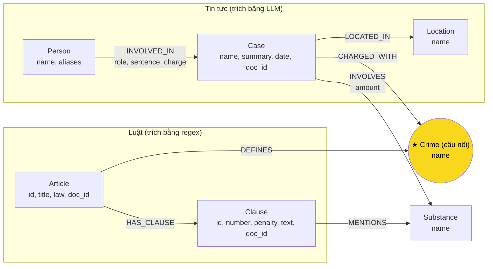

# Thiết kế Ontology — Day 19

**Họ tên:** Lê Gia Bảo  **MSSV:** 02887

**Lựa chọn:**
- [x] Dùng ontology gợi ý (có chỉnh nhỏ ở bước trích xuất — xem mục 6.3)
- [ ] Tự thiết kế (xét bonus +15)

> Ontology gợi ý trong `src/graph.py` (các hàm `HINT`) đã đủ để trả lời 5/6 câu benchmark với chi phí
> trích xuất thấp (luật dùng regex, tin dùng 1 lần gọi LLM/bài). Phần code (`KG-1..KG-4`) dùng nguyên các
> hàm `parse_law_article`, `extract_news_cases`, `add_law_article`, `add_news_case`; phần tự viết là
> `link_entity` (KG-1), `build_graph` (KG-2 — lắp ráp các hàm HINT), và Cypher multi-hop trong
> `Neo4jGraph.context` (KG-3).

## 1. Sơ đồ

`Crime` là node cầu nối duy nhất: phía trái (luật) định nghĩa tội qua `DEFINES`; phía phải (tin) buộc tội
qua `CHARGED_WITH`. `Substance` là node dùng chung thứ hai (cả hai KB cùng nhắc tới cùng tên chất) nhưng
không đóng vai trò cầu nối chính vì không phải vụ án nào cũng nêu rõ khối lượng/tên chất khớp đúng text
luật.

## 2. Entity types (node labels)

| Label | Ý nghĩa | Khóa định danh (`MERGE` theo) | Properties | Lấy từ KB nào | Trích bằng (regex / LLM / khác) |
| --- | --- | --- | --- | --- | --- |
| `Article` | Một Điều luật (BLHS hoặc Luật PCMT) | `id` (vd `"Điều 251 BLHS"`) | `id, title, law, doc_id` | luật | regex — `parse_law_article` (tách từ front-matter `article`) |
| `Clause` | Một khoản trong Điều, mang khung hình phạt | `id` (vd `"Điều 251 BLHS khoản 1"`) | `id, number, penalty, text, doc_id` | luật | regex — `CLAUSE_START` tách theo `"^(\d+)\. "`, `penalty` lấy bằng regex `bị (phạt\|tù\|cảnh cáo)…` |
| `Crime` | Tên tội danh đã chuẩn hóa (node cầu nối) | `name` (chuẩn hóa bằng `normalize_crime`) | `name` | luật (tiêu đề Điều, chỉ Điều có tiêu đề bắt đầu `"Tội "`) | regex (luật) + `link_entity` (tin, map tội LLM trích ra về đúng tên này) |
| `Case` | Một vụ án cụ thể trong 1 bài báo | `name` (tên do LLM đặt, fallback tiêu đề bài báo) | `name, summary, date, doc_id, source_title` | tin | LLM — `extract_news_cases` (prompt `NEWS_EXTRACTION_PROMPT`, `json_mode=True`) |
| `Person` | Người liên quan vụ án (bị cáo, bị can, nghi phạm…) | `name` (tên do LLM trích, không gộp alias) | `name, aliases` | tin | LLM |
| `Location` | Tỉnh/thành phố xảy ra/xét xử vụ án | `name` | `name` | tin | LLM |
| `Substance` | Tên chất ma túy (từ danh sách `SUBSTANCES` cố định) | `name` | `name` | cả hai | regex (luật, `find_substances` quét text khoản) + LLM có gợi ý danh sách chuẩn (tin) |

## 3. Relationships

| Type | Từ → Đến | Properties trên cạnh | Ý nghĩa |
| --- | --- | --- | --- |
| `DEFINES` | `Article` → `Crime` | — | Điều luật định nghĩa tội danh này |
| `HAS_CLAUSE` | `Article` → `Clause` | — | Điều gồm các khoản |
| `MENTIONS` | `Clause` → `Substance` | — | Khoản nhắc tới chất này (làm căn cứ khung hình phạt theo khối lượng) |
| `CHARGED_WITH` | `Case` → `Crime` | — | Vụ án bị truy tố về tội này — **cạnh đi qua node cầu nối** |
| `INVOLVES` | `Case` → `Substance` | `amount` (khối lượng, chuỗi tự do) | Vụ án liên quan chất này với khối lượng cụ thể |
| `LOCATED_IN` | `Case` → `Location` | — | Vụ án xảy ra/xét xử tại địa phương này |
| `INVOLVED_IN` | `Person` → `Case` | `role, sentence, charge` | Người này tham gia vụ án với vai trò, mức án, và tội danh (nếu có, mỗi người có thể bị truy tố tội riêng khác tội chung của vụ) |

## 4. Node cầu nối giữa 2 KB

- **Node nào:** `Crime` (tội danh đã chuẩn hóa).
- **Vì sao chọn node này:** đây là khái niệm duy nhất mà cả luật (định nghĩa tội + khung hình phạt) và tin
  tức (vụ án bị truy tố tội gì) cùng nhắc tới bằng một cái tên gần giống nhau. `Substance` cũng xuất hiện ở
  cả hai KB nhưng không đặc trưng cho một vụ án cụ thể bằng `Crime`, và nhiều vụ không nêu rõ khối lượng/tên
  chất khớp chính xác với text luật.
- **Cách đảm bảo hai phía khớp tên:** luật tạo `Crime` trước (từ tiêu đề Điều, qua `normalize_crime`: hạ
  chữ thường, bỏ khoảng trắng thừa, bỏ tiền tố `"tội "`). Khi trích tin, prompt LLM được đưa thẳng
  **danh sách tội danh chuẩn đã có trong luật** (`known_crimes`) và yêu cầu chọn nguyên văn từ danh sách
  đó; sau đó mỗi tội LLM trả về (cả tội chung của vụ và tội riêng của từng người) đều chạy qua
  `link_entity(x, known_crimes)`: khớp chính xác sau chuẩn hóa → fuzzy match
  `difflib.get_close_matches(cutoff=0.8)` → nếu vẫn không đủ giống thì bỏ qua (`None`), không tạo `Crime`
  mới từ phía tin để tránh sinh node trùng.
- **Khi nào cầu gãy, và xử lý thế nào:** gãy khi (1) LLM trích một tội danh không nằm trong luật đã crawl
  (vd tội không thuộc Chương XX BLHS) — lúc đó `link_entity` trả `None` và `add_news_case` không tạo cạnh
  `CHARGED_WITH`, vụ án trở thành "mồ côi" (lỗi **E1**); hoặc (2) LLM diễn đạt tội danh khác xa cách viết
  trong luật quá ngưỡng `cutoff=0.8` của `difflib` (vd viết tắt, chỉ nêu tên chất mà không nêu hành vi).
  Cách xử lý hiện tại: chấp nhận bỏ cạnh thay vì nối sai (ưu tiên precision hơn recall, theo đúng khuyến
  nghị LAB_GUIDE "nối sai còn tệ hơn không nối") — đánh đổi là một số vụ hợp lệ có thể bị bỏ sót nếu cách
  diễn đạt quá lệch.

## 5. Competency questions

| Câu | Đường đi (Cypher pattern) | Trả lời được? |
| --- | --- | --- |
| Q1 | Không cần graph: `seed_facts` tìm `Article`/`Clause` có `doc_id` trùng kết quả vector search (câu hỏi định nghĩa "tiền chất" nằm trong Điều 2 Luật PCMT) | **Có**, nhưng thuần qua chunk văn bản — graph không thêm giá trị cho câu single-hop-law |
| Q2 | `(:Person)-[:INVOLVED_IN {sentence:'tử hình'}]->(:Case {name: 'vụ 36kg...'})` — toàn bộ nằm trong 1 bài báo, `seed_facts` đã đủ (1-hop quanh node `Case`/`Person` seed theo `doc_id`) | **Có**, không cần qua node cầu nối |
| Q3 | `(:Person {name:'Lê Minh Thành'})-[:INVOLVED_IN {sentence}]->(:Case)-[:CHARGED_WITH]->(:Crime)<-[:DEFINES]-(:Article {id:'Điều 251 BLHS'})-[:HAS_CLAUSE]->(:Clause {number:1, penalty:'phạt tù từ 02 năm đến 07 năm'})` | **Có** — đúng đường multi-hop qua cầu nối `Crime` |
| Q4 | `(:Person {name~'Hoàng Nato', aliases})-[:INVOLVED_IN]->(:Case)-[:CHARGED_WITH]->(:Crime {name:'tổ chức sử dụng trái phép chất ma túy'})<-[:DEFINES]-(:Article {id:'Điều 255 BLHS'})-[:HAS_CLAUSE]->(:Clause)` | **Một phần.** Điều 255 không hề nhắc tên chất ma túy trong bất kỳ khoản nào (khung tăng nặng dựa trên số nạn nhân/tỷ lệ thương tật, không dựa khối lượng chất) — bộ lọc KG-3 *"khoản 1 HOẶC khoản MENTIONS chất mà vụ INVOLVES"* chỉ lấy được khoản 1 (2–7 năm), **bỏ sót khoản 4** (20 năm/chung thân) vì khoản 4 không `MENTIONS` `Substance` nào để khớp. Đây là hạn chế thật đã kiểm chứng trên text luật — xem mục 8 và lỗi **E2** trong `report/REPORT_KG.md`. |
| Q5 | `(:Person {name:'Cái Quang Huy'})-[:INVOLVED_IN]->(:Case)-[:INVOLVES {amount:'~9.6kg'}]->(:Substance {name:'MDMA'})`, `(:Case)-[:CHARGED_WITH]->(:Crime {name:'vận chuyển trái phép chất ma túy'})<-[:DEFINES]-(:Article {id:'Điều 250 BLHS'})-[:HAS_CLAUSE]->(:Clause)` lọc theo `MENTIONS (:Substance {name:'MDMA'})` | **Có** — Điều 250 nhắc "MDMA" ở mọi khoản có khung theo khối lượng (khoản 1–4), nên bộ lọc khớp đúng khoản 4 (≥100g → tử hình) |
| Q6 | `MATCH (k:Case)-[:INVOLVES]->(:Substance {name:'MDMA'}) RETURN k.name, k.summary` — câu hỏi tổng hợp, không đi qua cầu nối, chỉ cần gộp mọi `Case` có cạnh `INVOLVES` tới `Substance {name:'MDMA'}` | **Có**, miễn LLM trích đúng "MDMA" làm 1 phần tử trong mảng `substances` của từng vụ liên quan |

## 6. Quyết định thiết kế và đánh đổi

1. **Mức độ chi tiết của luật: tách tới khoản (`Clause`), không tách tới điểm (`a)`, `b)`…).**
   Phương án khác: tách mỗi điểm (vd "điểm h khoản 2") thành node riêng để biết chính xác ngưỡng khối
   lượng áp dụng. Chọn dừng ở khoản vì: (a) điểm chỉ xuất hiện ở khoản tăng nặng và đa số câu hỏi benchmark
   chỉ cần khung hình phạt theo khoản, không cần biết chính xác điểm nào; (b) tách tới điểm làm graph lớn
   hơn nhiều (Điều 251 có ~30 điểm) và mỗi fact phải dài hơn khi đưa vào prompt → tốn token hơn cho lợi ích
   nhỏ. Đánh đổi: không trả lời chính xác 100% các câu hỏi cần biết đúng điểm nào trong khoản áp dụng.

2. **`Substance` dùng danh sách tên cố định (`SUBSTANCES`), không để LLM tự do đặt tên chất.**
   Phương án khác: để LLM tự trích tên chất nguyên văn từ bài báo (vd "ma túy đá", "hàng trắng"). Chọn
   danh sách cố định vì nó khớp trực tiếp với tên chất xuất hiện trong text luật (regex `find_substances`
   dùng chung danh sách này cho cả hai KB) — đảm bảo cạnh `MENTIONS` (luật) và `INVOLVES` (tin) trỏ về
   **cùng một node** `Substance` mà không cần thêm một `link_entity` thứ hai. Đánh đổi: bỏ sót chất ma túy
   không có trong danh sách 10 tên hiện tại, hoặc gộp sai khi báo dùng tên lóng không map được về tên
   chuẩn (LLM được đưa danh sách trong prompt nhưng không bị ép buộc).

3. **`link_entity` ưu tiên precision: không khớp đủ giống thì bỏ qua, không đoán.**
   Phương án khác: hạ `cutoff` xuống thấp hơn 0.8, hoặc luôn tạo `Crime` mới nếu LLM trả tội danh lạ.
   Chọn giữ `cutoff=0.8` và trả `None` khi không chắc, vì nối sai cầu nối (một `Case` bị gắn nhầm `Crime`)
   làm hỏng mọi suy luận multi-hop phía sau — sai một cạnh ảnh hưởng toàn bộ câu trả lời liên quan đến vụ
   đó. Đánh đổi: một số vụ hợp lệ bị rớt khỏi graph nếu LLM diễn đạt tội danh quá khác luật (lỗi E1 có thể
   do bước này).

4. **Trích luật bằng regex, trích tin bằng LLM (không dùng LLM cho cả hai, cũng không dùng regex cho cả hai).**
   Phương án khác: dùng LLM cho tất cả để code đơn giản hơn. Chọn tách hai cách vì luật có cấu trúc lặp
   rất đều (Điều → khoản đánh số → "thì bị phạt...") nên regex cho kết quả **xác định** (deterministic),
   rẻ (0 token) và không thay đổi giữa các lần chạy — phù hợp để benchmark công bằng. Tin tức là văn xuôi
   tự do, không có cấu trúc để regex bắt được tên người/mức án một cách tin cậy, nên bắt buộc dùng LLM.
   Đánh đổi: pha trộn hai nguồn trích xuất nghĩa là dữ liệu phía tin không ổn định 100% giữa các lần chạy
   (LLM temperature=0 nhưng vẫn có thể lệch nhẹ), còn phía luật thì luôn giống hệt nhau.

## 7. So với ontology gợi ý

*Không áp dụng — bài làm dùng nguyên ontology gợi ý (không xét bonus +15). Thay đổi duy nhất so với HINT
nằm ở cách lọc khoản trong `Neo4jGraph.context` (mục 5, Q4/Q5): thay vì hard-code hậu tố `" BLHS"` khi so
khớp "Điều N" nhắc trong câu hỏi, dùng `a.id STARTS WITH ('Điều ' + n + ' ')` để khớp được cả Điều thuộc
BLHS lẫn Luật PCMT — đây là một sửa lỗi nhỏ cho đúng hợp đồng, không phải một thay đổi ontology.*

## 8. Hạn chế còn lại

- **Không mô hình hóa ngưỡng khối lượng dưới dạng dữ liệu truy vấn được** — khối lượng chỉ nằm trong text
  tự do của `Clause.text`, không phải property số. Không thể viết Cypher kiểu "tìm khoản áp dụng cho đúng
  9,6kg MDMA", phải để LLM đọc text khoản và tự suy luận ngưỡng nào áp dụng.
- **Khung hình phạt không dựa trên khối lượng chất bị bỏ sót** — đã kiểm chứng cụ thể trên Điều 255 (Q4):
  các khoản tăng nặng dựa trên số nạn nhân/tỷ lệ thương tật không `MENTIONS` `Substance` nào, nên bộ lọc
  "khoản 1 + khoản mention chất" trong KG-3 không lấy được các khoản này. Ảnh hưởng mọi Điều có khung tăng
  nặng phi-khối-lượng (vd Điều 259 dựa trên hành vi quản lý, Điều 255 dựa trên hậu quả).
- **`Case`/`Person` khóa theo tên do LLM tự đặt** → cùng một người có thể viết tên hơi khác giữa các lần
  chạy hoặc giữa hai bài báo khác nhau (vd có/không kèm năm sinh), dễ sinh nhiều node cho cùng một người
  (lỗi E3).
- **Không phân biệt giai đoạn tố tụng** (bắt, khởi tố, xét xử sơ thẩm, phúc thẩm) — một `Case` gộp chung
  mọi giai đoạn vào một `summary`/`sentence`, nên nếu một vụ có mức án thay đổi qua phúc thẩm thì graph chỉ
  giữ được giá trị LLM trích gần nhất, có thể mâu thuẫn giữa các bài báo viết về cùng vụ ở các thời điểm
  khác nhau.
